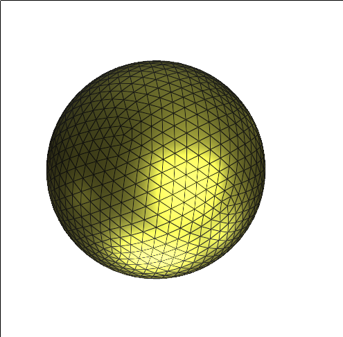

# fast_icosphere

To play with the project, use [this fork, which has instructions in the readme](https://github.com/gumeo/polyscope).

There are some opportunities for improvements, e.g. pre-allocate memory instead of using `push_back` on the vertices and faces. The program is correct now, I might put some more time into it later.
