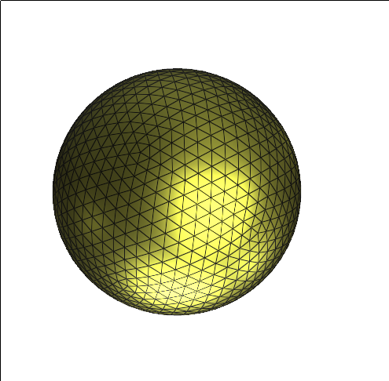

# fast_icosphere

To play with the project, use [this fork, which has instructions in the readme](https://github.com/gumeo/polyscope).

There are some opportunities for improvements, e.g. pre-allocate memory instead of using `push_back` on the vertices and faces. The program is correct now, I might put some more time into it later.

## Summary of AI assisted improvements

The following optimizations were applied while keeping the same algorithmic approach:

1. **`std::map` → `std::unordered_map`** with a custom hash for edge keys — O(1) vs O(log n) lookups.
2. **`std::vector<size_t>` faces → `std::array<size_t, 3>`** — eliminates millions of small heap allocations since each face is always exactly 3 indices.
3. **Edge data stores only vertex indices**, not redundant position copies — positions are looked up from the vertex array when needed.
4. **Eliminated copies** — `FillIcoFace` now references edge data via `const auto&` instead of copying vectors, and uses `std::swap` on row buffers instead of reallocating.
5. **Inlined normalization** using `1.0/sqrt(...)` multiply instead of 3 divisions.
6. **Added missing `#include <array>`** (was needed to compile with modern GCC).

### Benchmark results

Compiled with `g++ -O2 -std=c++17`. Times are averaged over multiple runs.

| n | Vertices | Before (ms) | After (ms) | Speedup |
|---|----------|-------------|------------|---------|
| 10 | 1,212 | 0.22 | 0.02 | **11x** |
| 50 | 26,012 | 5.07 | 0.34 | **15x** |
| 100 | 102,012 | 19.87 | 1.28 | **16x** |
| 200 | 404,012 | 82.04 | 9.28 | **9x** |
| 500 | 2,510,012 | 511.10 | 80.01 | **6x** |
